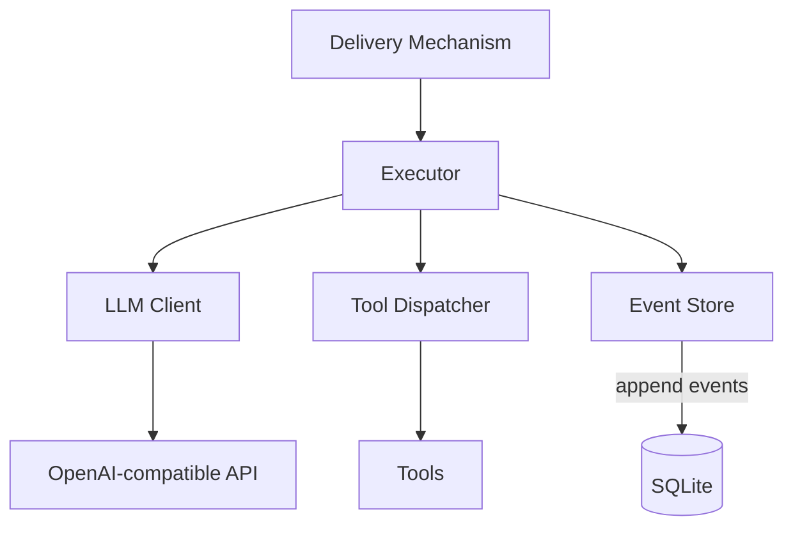

# runloop                                                  
                                                                                                                         
## Problem

When LLM calls are expensive, non-deterministic, and slow, that means lost progress on crashes, opaque failures, and no durable record of what happened or what it cost. Runloop separates *building* an agent from *running* agent workloads as managed infrastructure.

## Solution

Every state transition — LLM call, tool call, result, failure — is an immutable event appended to a durable log. Current state is derived by replaying events, never stored as a mutable snapshot. Runs are first-class resources with identity, lifecycle, and observability built into the data model.

## Architecture

The domain core — Run, Step, event sourcing, state reconstruction — is delivery-mechanism-independent. The delivery mechanism is a thin layer that wires dependencies and invokes the executor.

## Usage

Coming soon...